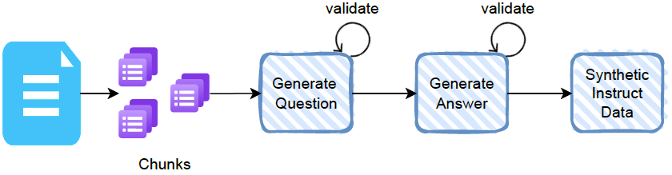

# Modify or Use Existing Databuilders

In this section, we'll go through the process of developing a new databuilder by using code from existing databuilders (`skills_sdg` and `knowledge_sdg`). 

For this exercise, let's generate data for aligning models to particular values and policies. 

**Note:** *There is already an implementation of the databuilder from this tutorial in FMS-DGT called [`policy_sdg`](https://github.ibm.com/conversational-ai/fms-dgt-internal/tree/main/src/databuilders/generation/policy_sdg). This tutorial is a demonstration of the steps needed to implement such a pipeline without having to start from scratch.*

## Prerequisites

To successfully run this, you will need to have completed the following:

1. Followed the [installation guide](../getting_started/installation.md) to set up your virtual environment
2. Read through the [Data Builders](../key_concepts/databuilders.md) and [Task](../key_concepts/tasks.md) sections

## In this Tutorial

1. Copy existing databuilder
2. Add seed examples and define task.yaml
3. Modify task.py (define `PrincipledSdgData` and `PrincipledSdgTask`)
4. Add prompt templates and modify prompts.py
5. Modify generate.py and utils.py (define `PrincipledDataBuilder`)
6. Configure databuilder (define `principled_sdg.yaml`)
7. Generate data 🚀

## Copy existing databuilder

We'll start by copying the `skills_sdg` directory and renaming it to `principled_sdg`

```bash
# from repo root
cp -r fms_dgt/research/databuilders/instructlab/skills_sdg fms_dgt/research/databuilders/principled_sdg 
```

You will notice the following files and folders in the `principled_sdg` folder:

```bash
README.md       generate.py     prompts.py      skills_sdg.yaml task.py         templates       utils.py
```

From that directory, let's first remove the files we dont need

```bash
rm -rf  fms_dgt/research/databuilders/principled_sdg/prompts.py
rm -rf  fms_dgt/research/databuilders/principled_sdg/templates
```

Let's instead use the prompts file from `knowledge_sdg`

```bash
cp -r fms_dgt/research/databuilders/instructlab/knowledge_sdg/prompts.py fms_dgt/research/databuilders/principled_sdg/prompts.py
```

Let's also rename `skills_sdg.yaml`

```bash
mv fms_dgt/research/databuilders/principled_sdg/skills_sdg.yaml fms_dgt/research/databuilders/principled_sdg/principled_sdg.yaml
```

## Add seed examples and define task.yaml
Before we define the task YAML, let's understand the task a little. 



We want to use IBM's business conduct guidelines to generate _instruction_ style data for finetuning purposes. These guidelines are broken into several paragraphs and then we prompt an LLM to generate instruction-response pairs using these paragraphs. 

The task YAML specifies:
- the databuilder `principled_sdg` which we will implement later
- task description 
- seed examples
- other task-specific fields (`keyword` in this case)

Create a file `tasks/research/ibm_policy/bcg/task.yaml` and the following to it.

```yaml
created_by: ibm
task_name: bcg_policy
data_builder: principled_sdg 
task_description: "IBM Business Conduct Guidelines"
keyword: policy
seed_examples:
  - context:
      "Integrity Means We Commit to Ethics and Compliance: Our Values and the\
      \ Business Conduct Guidelines\nIBM has long been recognized as one of the world\u2019\
      s most ethical companies. For more than one hundred years, we\u2019ve repeatedly\
      \ reinvented ourselves to meet new challenges. What always has remained unchanged\
      \ is our unwavering commitment to integrity. Our IBM Values serve as a solid foundation\
      \ for the business choices we make. The Business Conduct Guidelines (BCGs) provide\
      \ general guidance for resolving a variety of legal and ethical issues. IBM\u2019\
      s Values: Dedication to every client\u2019s success. Innovation that matters\u2014\
      for our company and for the world. Trust and personal responsibility in all relationships."
  - context:
      "Integrity Means We Commit to Ethics and Compliance: The Importance of\
      \ Integrity and Compliance\nIntegrity and compliance are vital to IBM\u2019s success\
      \ \u2013 and yours. Our integrity, reputation and brand are in your hands, and\
      \ we rely on you to protect them! No matter where your workplace is \u2013 whether\
      \ you work with IBMers, clients, Business Partners, suppliers or other parties\
      \ in person, over the phone, online or by any other means \u2013 follow our Values,\
      \ the BCGs and other applicable IBM corporate directives, such as IBM policies,\
      \ corporate instructions and guidelines (Corporate Directives). And comply with\
      \ all laws and regulations that apply to IBM\u2019s business. Always use good\
      \ judgment in your work. If you have questions about interpreting or applying\
      \ the BCGs, Corporate Directives, or laws and regulations applicable to IBM, don\u2019\
      t guess. Ask for help. It\u2019s your responsibility to consult your manager or\
      \ IBM Counsel, or use one of the IBM Communication Channels. If you violate the\
      \ BCGs, other Corporate Directives or the law, IBM may take any action regarding\
      \ your employment, including termination of employment, subject to applicable\
      \ law. Failing to comply with laws could also result in fines, lawsuits, loss\
      \ of business privileges and, in some cases, imprisonment."
```


## Modify task.py (define `PrincipledSdgData` and `PrincipledSdgTask`)

The `task.py` file contains two main abstractions:
- `SdgData` which holds the seed and synthetic generated data
- `SdgTask` which holds the basic information of an SDG task 

We will extend these two classes to reflect the data schema of our seed and generated data. Let's go ahead and modify this file so it looks like this:

```python
# Standard
from dataclasses import dataclass
from typing import Any, Optional

# Local
from fms_dgt.base.task import SdgData, SdgTask


@dataclass(kw_only=True)
class PrincipledSdgData(SdgData):
    """This class is intended to hold the seed / machine-generated instruction data"""

    taxonomy_path: str
    task_description: str
    keyword: str
    question: str
    answer: str
    context: Optional[str] = None


class PrincipledSdgTask(SdgTask):
    """This class is intended to hold general task information"""

    INPUT_DATA_TYPE = PrincipledSdgData
    OUTPUT_DATA_TYPE = PrincipledSdgData

    def __init__(
        self,
        *args: Any,
        keyword: str,
        **kwargs: Any,
    ):
        self.keyword = keyword
        super().__init__(*args, **kwargs)

    def instantiate_input_example(self, **kwargs: Any):
        return self.INPUT_DATA_TYPE(
            task_name=self.name,
            taxonomy_path=self.name,
            task_description=self.task_description,
            keyword=self.keyword,
            answer=kwargs.get("answer", None),
            question=kwargs.get("question", None),
            context=kwargs.get("context", None),
        )

    def instantiate_output_example(self, **kwargs: Any):
        kwargs.pop("context", None)
        kwargs.pop("keyword", None)

        return self.OUTPUT_DATA_TYPE(**kwargs)
```

## Add prompt templates and modify prompts.py

We will store all of our prompt templates specific to this task in the templates directory. 

```bash
mkdir fms_dgt/research/databuilders/principled_sdg/templates
```

Within this directory, let's add the following. 

- Question and answer generation templates

*question_template.txt*
```
You are asked to come up with a set of { { nex } } diverse questions based on the below passage.

Please follow these guiding principles when generating responses:
* Use proper grammar and punctuation.
* The questions should be clear and human-like.
* Always generate questions that are relevant to the prompt and consistent with the passage.
* The questions should not be template-based or generic, it should be very diverse.
* Simply return the questions based on the passage, do not return any answers or explanations.

Here is an example of the JSONL formatting:
{"question": "question with scenario or situation"}

Passage: { { context } }

Now, generate { { nex } } scenario or situation-based questions that test the { { keyword } } in the passage, either implied or explicitly mentioned, and remember to follow the principles mentioned above. Return your response in JSONL format.
```

*answer_template.txt*
```
Context information is below.
---------------------
{ { context } }
---------------------
Answer the below query based on the above provided context, and no prior knowledge. Don't use the phrase "Based on the context provided". 
Query: { { question } }
Answer: 
```

- We also need LLM judge prompts for question and answer validation

*judge_question_template.txt*

```
Given the passage below and the question that follows, please rate the question on how relevant it is to the given passage. Answer 1 if the question is relevant to the policies outlined in the passage. Otherwise answer 0.

Here is the passage followed by the question:

Passage: { { context } }

Question: { { question } }
```

*judge_answer_template.txt*
```
**Instructions:** You are given a context, a question based on the context, and an answer to that question. Determine if the answer provided for the given question is corroborated by the given context. Respond with 'YES' if the context substantiates the answer, even partially. Respond 'NO' if the context does not support the answer. Provide a brief explanation for your response.

**Guidelines:**
- Respond 'YES' when the context provides either direct or indirect evidence supporting the answer. Indirect evidence may include contextual implications or inferred connections that reasonably support the information.
- Respond 'NO' if the context lacks any supportive evidence, clearly contradicts the answer, or if the support provided by the context is too vague or speculative to establish a solid connection to the question and context.
- Avoid using "partially" in your response. If the context provides any reasonable support (direct or indirect) for the answer, consider it as a 'YES'.

**Example 1:**
- **Context:** An apple pie is a fruit pie with apples as the main filling. It's often served with whipped cream, ice cream, custard, or cheddar cheese. Typically, it has a double crust, with pastry above and below the filling. The upper crust can be solid or latticed.
- **Question:** What kind of a crust does an apple pie have?
- **Answer:** An apple pie is "generally double-crusted".
- **Response:** YES

**Example 2:**
- **Context:** An apple pie is a fruit pie with apples as the main filling. It's often served with whipped cream, ice cream, custard, or cheddar cheese. Typically, it has a double crust, with pastry above and below the filling. The upper crust can be solid or latticed.
- **Question:** How does an apple pie taste?
- **Answer:** Apple pies taste bad
- **Response:** NO

**Now, based on the above examples and guidelines, determine if the answer for the given question is supported by the context provided. Respond YES or NO.**
- **Context:** { { context } }
- **Question:** { { question } }
- **Answer:** { { answer } }
```

- Now let's create `teacher_config.yaml` and `judge_config.yaml` to easily route our prompts

*teacher_config.yaml*
```yaml
# prompt templates for qa generation
gen_question_template: question_template.txt
gen_answer_template: answer_template.txt
```

*judge_config.yaml*
```yaml
# prompt templates for qa judge
judge_question_template: judge_question_template.txt
judge_answer_template: judge_answer_template.txt
```

- Finally, let's modify `prompts.py` so it looks like this

```python
# Standard
from typing import Dict, List
import re

# Third Party
import jinja2
import yaml

# Local
from fms_dgt.base.prompt import PromptTemplate


class PrincipledSdgPrompt(PromptTemplate):
    """
    Requires path to yaml config and a prompt_type which can either be 'generate' or 'validate'
    """

    def __init__(
        self,
        template_path: str,
        stop_sequences: List[str] = ["[</s>]"],
    ):
        self.environment = jinja2.Environment()
        prompt_str = open(template_path, "r", encoding="utf-8").read()
        super().__init__(
            prompt_str=prompt_str,
            stop_sequences=stop_sequences,
        )

    def from_txt(self, file_path: str):
        with open(file_path, "r", encoding="utf-8") as file:
            return file.read()

    def encode_prompt(
        self,
        render_dict: Dict,
    ):
        prompt_str = self.environment.from_string(self._prompt)
        return prompt_str.render(**render_dict)

```

## Modify generate.py (define `PrincipledSdgDataBuilder`)

With the task file defined, we can now work on the code that will be used to actually execute data generation. 

```python
# Standard
from typing import Any, Dict, List, Optional, Tuple
import copy
import os
import random

# Third Party
import yaml

# Local
from fms_dgt.base.databuilder import DataBuilder
from fms_dgt.base.registry import register_data_builder
from fms_dgt.base.task import SdgTask, group_data_by_task
from fms_dgt.blocks.llm import LMProvider
from fms_dgt.blocks.validators.lm_judge import LMJudgeValidator
from fms_dgt.utils import sdg_logger
from fms_dgt.research.databuilders.principled_sdg.prompts import PrincipledSdgPrompt
from fms_dgt.research.databuilders.principled_sdg.task import PrincipledSdgData, PrincipledSdgTask
import fms_dgt.research.databuilders.principled_sdg.utils as utils


@register_data_builder("principled_sdg")
class PrincipledSdgDataBuilder(DataBuilder):
    """Class for generating instruction-response pairs using seed data from the `compositional_skills` branch of InstructLab's taxonomy"""

    TASK_TYPE: SdgTask = PrincipledSdgTask

    # llm1 is the main generator that will produce the synthetic examples
    llm1: LMProvider

    # val1 is the validator which checks the quality of generated synthetic examples
    val1: LMJudgeValidator

    def __init__(
        self,
        *args: Any,
        num_prompt_instructions: Optional[int] = 1,
        prompt_file_path: Optional[str] = None,
        request_batch_size: Optional[int] = 5,
        **kwargs: Any,
    ):
        super().__init__(*args, **kwargs)

        self._num_prompt_instructions = num_prompt_instructions
        self._request_batch_size = request_batch_size
        _ = prompt_file_path  # not using the command line arg, since we define teacher config in databuilder yaml

        teacher_config = self.config.metadata["teacher_config"]
        teacher_config = os.path.join(
            os.path.split(os.path.abspath(__file__))[0], teacher_config
        )
        judge_config = self.config.metadata["judge_config"]
        judge_config = os.path.join(
            os.path.split(os.path.abspath(__file__))[0], judge_config
        )
        self._load_prompts(teacher_config, judge_config)

    def __call__(
        self,
        request_idx: int,
        context_data: List[PrincipledSdgData],
    ) -> List[PrincipledSdgData]:

        # We group the seed data by similar tasks, then for each group
        # we check whether they have context present
        final_generated_data: List[PrincipledSdgData] = []
        for task_data in group_data_by_task(context_data):
            # If context is present, we pass the data to `_generate_data_with_context`
            qa_pairs_with_context = self._generate_data_with_context(task_data)
            final_generated_data.extend(qa_pairs_with_context)
        return final_generated_data

    def _generate_data_with_context(self, context_data: List[PrincipledSdgData]):
        shuffled_data = context_data + []
        random.shuffle(shuffled_data)

        # step 1: question generation
        generated_questions = self._generate_questions(shuffled_data)

        validated_questions = self._validate_questions(generated_questions)

        # step 2: answer generation
        generated_qa_pairs = self._generate_answers(validated_questions)
        
        validated_qa_pairs = self._validate_answers(generated_qa_pairs)

        return validated_qa_pairs

    def _generate_questions(
        self, context_data: List[PrincipledSdgData]
    ) -> List[PrincipledSdgData]:
        gen_q_inputs: List[Dict] = []

        for src_data in context_data:

            task_description = src_data.task_description
            gen_q_inp_dict = {
                "nex": self.config.metadata["nex"],
                "keyword": src_data.keyword,
                "context": src_data.context,
            }

            gen_q_prompt = self._gen_question_template.encode_prompt(gen_q_inp_dict)

            gen_inp = {
                "input": gen_q_prompt,
                "stop": self._gen_question_template.stop_sequences,
                "data": src_data,
            }
            gen_q_inputs.append(gen_inp)

        llm_outputs = self.llm1.generate(gen_q_inputs)

        outputs = []
        for output in llm_outputs:
            questions = utils.post_process_questions(output["result"])
            src_data = output["data"]
            for question in questions:
                new_instance = copy.copy(src_data)
                new_instance.question = question
                new_instance.context = src_data.context
                outputs.append(new_instance)

        return outputs

    def _validate_questions(
        self,
        question_data: List[PrincipledSdgData],
    ) -> List[PrincipledSdgData]:

        # handling the case all questions were ill-formatted
        if len(question_data) == 0:
            return []

        def is_relevant(text):
            if utils.get_question_validation_score(text) == 1:
                return True
            return False

        val_question_inputs: List[Dict] = []
        for gen_question in question_data:
            val_question_inp_dict = {
                "context": gen_question.context,
                "question": gen_question.question,
            }
            val_question_prompt = self._judge_question_template.encode_prompt(
                val_question_inp_dict
            )

            val_inp = {
                "input": val_question_prompt,
                "success_func": is_relevant,
                "stop": self._judge_question_template.stop_sequences,
                "data": gen_question,
            }
            val_question_inputs.append(val_inp)

        val_outputs = self.val1.generate(val_question_inputs)

        outputs = []
        for output in val_outputs:
            new_inst = copy.copy(output["data"])
            outputs.append(new_inst)

        sdg_logger.info("Removed %s questions", len(question_data) - len(outputs))
        return outputs

    def _generate_answers(
        self,
        question_data: List[PrincipledSdgData],
    ) -> List[PrincipledSdgData]:

        # handling the case all questions were ill-formatted
        if len(question_data) == 0:
            return []

        gen_answer_inputs: List[Dict] = []
        for gen_question in question_data:
            gen_answer_inp_dict = {
                "context": gen_question.context,
                "question": gen_question.question,
            }
            gen_ans_prompt = self._gen_answer_template.encode_prompt(
                gen_answer_inp_dict
            )

            gen_inp = {
                "input": gen_ans_prompt,
                "stop": self._gen_answer_template.stop_sequences,
                "data": gen_question,
            }
            gen_answer_inputs.append(gen_inp)

        llm_outputs = self.llm1.generate(gen_answer_inputs)

        outputs = []
        for output in llm_outputs:
            new_inst = copy.copy(output["data"])
            answer = utils.post_process_answer(output["result"])
            new_inst.answer = answer

            outputs.append(new_inst)

        return outputs

    def _validate_answers(
        self,
        answer_data: List[PrincipledSdgData],
    ) -> List[PrincipledSdgData]:

        # handling the case all questions were ill-formatted
        if len(answer_data) == 0:
            return []

        def is_faithful(text):
            if utils.get_faithfulness_score(text) == 1:
                return True
            return False

        val_answer_inputs: List[Dict] = []
        for gen_answer in answer_data:
            val_answer_inp_dict = {
                "context": gen_answer.context,
                "question": gen_answer.question,
                "answer": gen_answer.answer,
            }
            val_answer_prompt = self._judge_answer_template.encode_prompt(
                val_answer_inp_dict
            )

            val_inp = {
                "input": val_answer_prompt,
                "success_func": is_faithful,
                "stop": self._judge_answer_template.stop_sequences,
                "data": gen_answer,
            }
            val_answer_inputs.append(val_inp)

        val_outputs = self.val1.generate(val_answer_inputs)

        outputs = []
        for output in val_outputs:
            new_inst = copy.copy(output["data"])
            outputs.append(new_inst)

        sdg_logger.info("Removed %s qa pairs ", len(answer_data) - len(outputs))
        return outputs

    def _load_prompts(self, teacher_config_path, judge_config_path):
        with open(teacher_config_path, "r", encoding="utf-8") as f:
            teacher_config = yaml.safe_load(f)
        with open(judge_config_path, "r", encoding="utf-8") as f:
            judge_config = yaml.safe_load(f)

        prompt_file_path = os.path.dirname(teacher_config_path)
        judge_prompt_file_path = os.path.dirname(judge_config_path)

        self._gen_question_template = PrincipledSdgPrompt(
            os.path.join(prompt_file_path, teacher_config["gen_question_template"]),
        )
        self._gen_answer_template = PrincipledSdgPrompt(
            os.path.join(prompt_file_path, teacher_config["gen_answer_template"]),
        )

        self._judge_question_template = PrincipledSdgPrompt(
            os.path.join(judge_prompt_file_path, judge_config["judge_question_template"]),
        )
        self._judge_answer_template = PrincipledSdgPrompt(
            os.path.join(judge_prompt_file_path, judge_config["judge_answer_template"]),
        )
```

Let's also define the utility functions we used in the code above. 

*utils.py*
```python
# Standard
from typing import List
import ast
import json
import os
import re


def post_process_questions(ques_str: str):
    questions = ques_str.split("\n")
    post_questions = []

    for ques in questions:
        try:
            ques = json.loads(ques.strip())
            ques = ques["question"]
        except:
            continue
        post_questions.append(ques)

    return post_questions


def post_process_answer(answer: str):
    answer = answer.strip()
    return answer


def get_question_validation_score(model_response: str):
    """
    Assign relevancy score for a question
    Parameters:
    - model_response (str): Model response
    Return:
    relevancy_rating: The relevancy score
    """

    def is_relevant(text):
        # Regular expression to find the pattern "Answer: <number>"
        match = re.search(r"Answer:?\s+(\d+)", text, re.IGNORECASE)
        if match:
            # Extract and return the rating number
            return int(match.group(1))
        return 0

    question_relevancy_score = is_relevant(model_response)
    return question_relevancy_score


def get_faithfulness_score(model_response: str):
    """
    Assigns faithfulness score for a text
    Parameters:
    - model_response (str): Model response
    Return:
    faithfulness_rating: The faithfulness score
    """
    rating_regex_1 = re.compile(r"\*\*Response:\*\*\s*(\w+)")
    rating_regex_2 = re.compile(r"Response:\s*(\w+)")

    def extract_faithfulness_score(text):
        try:
            rating = rating_regex_1.findall(text)[0]
            return rating
        except Exception:
            try:
                rating = rating_regex_2.findall(text)[0]
                return rating
            except Exception:
                return "-1"

    faithfulness_rating = extract_faithfulness_score(model_response)
    faithfulness_rating = 1 if faithfulness_rating.lower() == "yes" else 0

    return faithfulness_rating
```

## Configure databuilder (define `principled_sdg.yaml`)

Finally we configure the databuilder YAML

```yaml
name: principled_sdg
blocks:
  - name: llm1
    type: rits
    base_url: https://inference-3scale-apicast-production.apps.rits.fmaas.res.ibm.com/mixtral-8x7b-instruct-v01/v1
    model_id_or_path: mistralai/mixtral-8x7B-instruct-v0.1
    temperature: 0.5
    max_new_tokens: 1024
    min_new_tokens: 1
  - name: val1
    type: llm_judge
    filter: true
    lm_config:
      type: rits
      base_url: https://inference-3scale-apicast-production.apps.rits.fmaas.res.ibm.com/mixtral-8x7b-instruct-v01/v1
      model_id_or_path: mistralai/mixtral-8x7B-instruct-v0.1
      decoding_method: greedy
      temperature: 0.0
      max_new_tokens: 1024
      min_new_tokens: 1 
metadata:
  version: 1.0
  teacher_config: templates/teacher_config.yaml
  judge_config: templates/judge_config.yaml
  nex: 5
```

## Generate data 🚀

Now that we have code for our SDG in place, we can run the generation code by executing the following command

`python -m fms_dgt.research --task-paths ./tasks/research/ibm_policy/bcg/task.yaml`

Once this completes, you should be able to find the output of your system at

`output/bcg_policy/data.jsonl`
