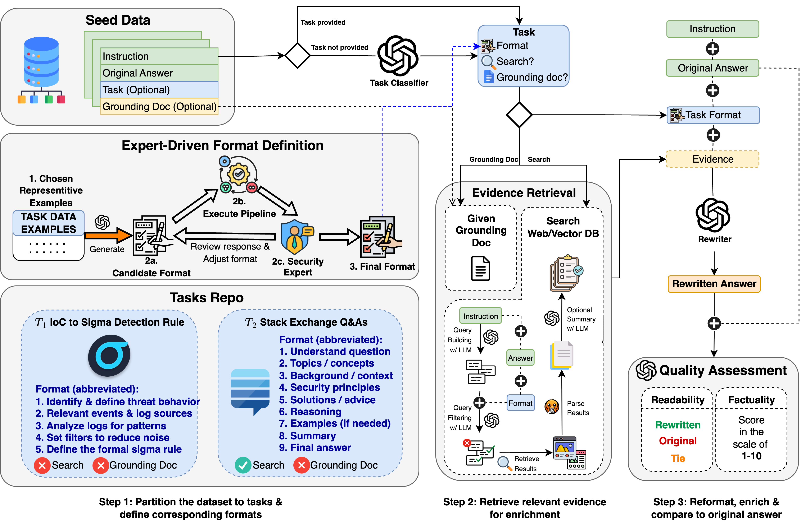

# SecKnowledge2

This pipeline is an implementation of the data reformatting and enrichment pipeline introduced in [CyberPal 2.0: TOWARD CYBERSECURITY-EXPERT SMALL LANGUAGE MODELS](https://www.arxiv.org/pdf/2510.14113).

SecKnowledge2 reformats the responses of instruction data into a format that better aligns with pre-established criteria and the collated evidence (by either web search, pre-defined grounding document, or retrieval results from a document corpus). This approach minimizes human annotation, hallucination, and the difficulty in scaling. Experimentally, SecKnowledge2 significantly boosts the general alignment ability, math reasoning, factuality, and readability of the LLMs.



The input to the pipeline is a dataset of instruction and desired responses for supervised fine tuning (SFT). The dataset may contain a large number of categories and sub-categories (for example, a category can be Cybersecurity and a sub-category can be MITRE ATT&CK). Each row in the dataset can be tagged with its corresponding category and sub-category - in case the row is not annotated LLM as a Judge will be utilized to find the main category, and then the sub-category. For each sub-category there is a pre-defined criteria we call template (more on that later).

The output of the pipeline is a dataset with the same instructions, and their corresponding reformatted responses.

## Categories & Sub-Categories

All categories and sub-categories that exists in the dataset must be defined ahead. For each sub-category the user must define the following parameters:

- `name` - the sub-category name (must be unique within the category)
- `description` - the sub-category description (used for the LLM as a Judge)
- `structure` - this is the most important part - detailed instructions that guide the LLM how to rewrite the answer.
- `requires_search` - a flag that indicates whether or not additional documents need to be retrieved from the web in order to ground or enrich the final answer
- `requires_grounding_doc` - a flag that indicates whether or not a grounding doc is provided for each question
- `requires_rewrite` - a flag that indicates whether or not the responses under this sub-category need rewriting. We might have some sub-categories that their responses are already good enough and don't need rewriting.

You should store your categories under the [`data/public/secknowledge2/templates`](data/public/secknowledge2/templates) folder. Check out the examples in [`data/public/secknowledge2/templates/vanilla.json`](data/public/secknowledge2/templates/vanilla.json) for templates used in the original [ReAlign paper](https://arxiv.org/pdf/2402.12219), and [`data/public/secknowledge2/templates/security.json`](data/public/secknowledge2/templates/security.json) for the templates used in the CyberPal 2.0 paper.

## Databuilder Configuration

The databuilder configuration is stored in [`secknowledge2.yaml`](secknowledge2.yaml) and contains numerous settings.

### Blocks

The SecKnowledge2 DataBuilder involves many unique building blocks that are used in different locations in the pipeline. The blocks are:

- `classifier` - LLMBlock that is used to classify untagged rows in the dataset into the most closely aligned category and sub-category. The recommended option is to specify them in advance (and hence, do not use this LLM).
- `query_builder` - LLMBlock that is used to extract search queries from the instruction, and then filter out irrelevant search queries based on the desired structure, and the existing response.
- `rewriter` - LLMBlock that is used to rewrite the response based on the collected evidence, the existing response, and the required structure. This LLMBlock is also used to summarize the webpages retrieved by the search engine.
- `judge` - LLMBlock that is used to evaluate the rewritten answer against the original answer on metrics like the readability (which answer is more readable) and factuality (score between 1-10).

### Specifications

Additional specifications to this DataBuilder are:

- `templates_path` - path to the folder with all the templates (combines all files in that folder). Defaults to `data/public/secknowledge2/templates/`
- `adaptive` - in adaptive mode, the rewriter LLM is asked to first take a look at the old response and check if it needs rewriting. If it does not need rewriting the original response will stay the same. Defaults to `False`.
- `search_method` - there are 3 options to what to search the web:
  - `instruction`: simply search the instruction.
  - `llm`: use LLM to create up to `max_queries_per_question`: search queries, and then filter some out based on the structure and original response. **This is the default.**
  - `hybrid_length`: If the instructions contains 50 characters or less, use `instruction`, otherwise, use `llm`.
- `search_queries_cache` - path to a file that contains mapping of instruction to its coresponding generated search queries, in case performed separately.

## Task Configuration

The secknowledge2 task contains additional settings such as:

- `seed_datastore` - the datastore configuration for the seed dataset.
- `max_queries_per_instruction` - the maximum number of search queries to generate (or load from `search_queries_cache`) for each instruction. Defaults to 2.
- `summarize_web_results` - whether to summarize each retrieved result guided by the task format of the instruction. Defaults to `False`.

### Retriever

This section includes the retriever configuration that is in charge of performing Web/VectorDB search and processing the results into readable markdown format.

- `type` - any type registered with `@register_retriever`. For example `core/web/duckduckgo`, `core/web/google` for web search, and `core/vector/elastic` or `core/vector/in_memory` for VectorDB search.
- `limit` - the maximum number of results to include in the context **for each search query**. Defaults to `2`.

Following are the options for each retriever class.

#### Web Retriever

- `process_webpages` - If `True`, process full HTML pages for each result. If `False`, returns only the snippet for each result. Defaults to `True`.
- `deduplicate_sources` - If `True`, filters out duplicate sources in case multiple search queries return the same page. Otherwise keeps duplicates. Defaults to `True`.
- `reorder_organic` - If `True`, reorders the results from multiple search queries such that results that appeared in more queries will precede results that appeared in less queries. If `False` results will be returned in the same order of the search queries. Defaults to `True`.
- `try_limit` - The maximum number of results to fetch before processing. Ignored if `<=limit`. This is useful if `process_webpages=True` to allow a buffer for unprocessable pages. Defaults to `8`.
- `webpage_processor` - The engine for parsing HTML web pages. Either `docling` or `firecrawl`. Defaults to `docling`.
- `fallback_retriever` - Optional engine to fall back to if `webpage_processor` fails to process a webpage. Defaults to `None`
- `cache_file` - Optional path to a file that contains mapping of search query to its coresponding search results, in case performed separately.

#### VectorDB

For VectorDB configurations, refer to [fms_dgt/core/retrievers/unstructured_text/vector_store/](fms_dgt/core/retrievers/unstructured_text/vector_store)

## Format Generation UI

For reformatting and enriching a given dataset D, the first step is to partition it into distinct tasks, each task representing a coherent sub-domain or capability. Since different problem types demand different ways of structuring outputs, each task must be paired with a corresponding format that defines the task more precisely by specifying the steps needed to be taken to provide a detailed and logically coherent answer. Manually constructing such tailored formats, however, can be highly time-consuming, particularly in specialized domains, where expert knowledge is required, yet remains both scarce and costly.

To efficiently scale format definition across a large and hierarchical label space, we developed an expert-in-the-loop system capable of semi-automatically generating and evaluating format templates. The system employs a LLM that, given a concise task description together with an optional set of illustrative instruction–response examples from any task, generates a corresponding candidate output format. Within the same framework, experts can immediately evaluate this format by executing the full pipeline on representative inputs, obtaining rewritten responses along with auxiliary feedback such as search results and LLM-as-a-judge scores for readability and factuality. Based on this feedback, experts can directly edit the format and rerun the pipeline, enabling a tight feedback loop that supports iterative refinement while substantially reducing the manual burden of format specification and enhancing the efficiency, accuracy, and scalability of the pipeline. 

Refer to [this GitHub repo](https://github.ibm.com/Daniel-Ohayon/realign-format-gen-ui) for experimenting with this framework, which is already loaded with tasks data from the SecKnowledge dataset introduced in [CyberPal](https://arxiv.org/abs/2408.09304).

## Usage

After setting up all the needed configuration, for running the pipeline, run:

```bash
num_outputs=$(jq length "data/public/secknowledge2/your_seed_dataset.json")
python -m fms_dgt.public \
      --task-paths "./tasks/public/secknowledge2/your_secknowledge2_task_name" \
      --restart-generation \
      --num-outputs-to-generate "$num_outputs" \
      --seed-batch-size 30 \
      --output-dir "output"
```

> NOTE: The pipeline autosaves every `seed-batch-size` examples processed

### Recovering From Failure

In case the pipeline was stopped the mid-execution for any reason, you can use the checkpoints saved every `seed-batch-size` examples to generate only what is left. Here is an example of a python script that does that:

```python
import os
import json

data = []
empty_gen = []
SAVE_NONES = True

# load realigned dataset and create mapping for fast lookup
if os.path.exists('/safelocation/realigned_dataset.json'):
    with open(f'/safelocation/realigned_dataset.json', 'r') as f:
        gen = json.load(f)
    inst_subcat_to_gen = {(g['instruction'], g['subcategory']): g for g in gen if g['rewritten_answer']}
    empty_gen.extend([g for g in gen if not g['rewritten_answer']])
else:
    inst_subcat_to_gen = {}

# load seed dataset
with open(f'data/public/secknowledge2/your_seed_dataset.json', 'r') as f:
  data = json.load(f)

# load generated data in most recent iteration and merge to mapping of realigned data
with open(f'output/your_realign_task_name/data.jsonl', 'r') as f:
  gen = [json.loads(l) for l in f.readlines() if l]

inst_subcat_to_gen |= {(g['instruction'], g['subcategory']): g for g in gen if g['rewritten_answer']}
empty_gen.extend([g for g in gen if not g['rewritten_answer']])

# save combined realigned dataset
with open('/safelocation/realigned_dataset.json', 'w') as f:
    gen_to_save = list(inst_subcat_to_gen.values())
    if SAVE_NONES:
        gen_to_save += empty_gen
    json.dump(gen_to_save, f, indent=2)

# store remaining examples that need ReAligning, and save to seed dataset file
remaining = [d for d in data if (d['instruction'], d['subcategory']) not in inst_subcat_to_gen]
print(f"Remaining examples: {len(remaining)}")

with open(f'data/public/secknowledge2/your_seed_dataset.json', 'w') as f:
    json.dump(s, f, indent=2)
```

> **IMPORTANT NOTE: If you are using this code, make sure you have a backup of `data/public/secknowledge2/your_seed_dataset.json` because it replaces it with the remaining examples that the pipeline did not go over yet.**

### Using Multiple RITS API Keys to Boost Generation

If many people collaborate on a project that needs this pipeline, you can split the seed dataset to the number of the available API keys and run multiple tasks in parallel.

#### Step 1. Split the dataset

First, you will need to split the dataset. Here is a quick snippet in python for doing so:

```python
import json

NUM_KEYS = ... # fill this

with open(f'data/public/secknowledge2/your_seed_dataset.json', 'r') as f:
  data = json.load(f)

splits = [[data[i] for i in range(k, len(data), NUM_KEYS)] for k in range(NUM_KEYS)]

for i, s in enumerate(splits, start=1):
  with open(f'data/public/secknowledge2/your_seed_dataset_{i}.json', 'r') as f:
    json.dump(s, f, indent=2)
```

#### Step 2. Create task for each API key

Second, you will need to create a different task for each API key. You can copy paste the same task and change 2 fields:

- `seed_datastore` should point to the current split data
- `task_name` must be unique for every key. If 2 tasks have the same name it can cause overwriting problems.

At this stage, your folder structure will look something like this:

```
data/
└── public/
    └── secknowledge2/
        ├── your_seed_dataset.json          # the original dataset
        ├── your_seed_dataset_1.json
        ├── your_seed_dataset_2.json
        ├── your_seed_dataset_3.json
        └── ...
...
tasks/
└── public/
    └── secknowledge2/
        ├── your_secknowledge2_task_name/
        │   └── task.yaml                   # the original task configuration
        ├── your_secknowledge2_task_name_1/
        │   └── task.yaml                   # same as your_secknowledge2_task_name/task.yaml but points to split 1's data & has name your_secknowledge2_task_name_1
        ├── your_secknowledge2_task_name_2/
        │   └── task.yaml                   # same as your_secknowledge2_task_name/task.yaml but points to split 2's data & has name your_secknowledge2_task_name_2
        ├── your_secknowledge2_task_name_3/
        │   └── task.yaml                   # same as your_secknowledge2_task_name/task.yaml but points to split 3's data & has name your_secknowledge2_task_name_3
        └── ...
```

#### Step 3. Run the pipeline

Next, you will need to run the pipeline separately for each task. This can be tedious if you have many API keys, so I prepared a bash script for running and tracking it automatically (reads api keys from `.env` - every api key should match the regex `RITS_API_KEY_\d+`):

```bash
#!/usr/bin/env bash
set -euo pipefail

DELAY=${1:-1}               # minutes; default = 1
ENV_FILE=${2:-".env"}

# Get the CUDA_VISIBLE_DEVICES variable (empty if not set)
devs="${CUDA_VISIBLE_DEVICES:-}"

# Convert comma-separated string into a Bash array
IFS=',' read -r -a visible_devs <<< "$devs"

# Display the array contents
echo "Visible CUDA devices array:"
printf '  [%s]\n' "${visible_devs[@]}"
num_devices=${#visible_devs[@]}
echo -e "Total: $num_devices\n"

mkdir -p secknowledge2_logs

declare -A total_outputs    # idx → total expected lines

# ---------- launch one process per API key -------------------------------
while IFS='=' read -r var val; do
  idx=${var##*_}                                # digits after last “_”
  key=$(echo "$val" | cut -d'#' -f1 | xargs)    # strip trailing comment

  num_outputs=$(jq length "data/public/secknowledge2/your_seed_dataset_${idx}.json")
  total_outputs[$idx]=$num_outputs              # remember for the watcher
  export RITS_API_KEY="$key"
  if (( $num_devices > 0 )); then
    cuda_device_idx=$(( idx % num_devices ))
    export CUDA_VISIBLE_DEVICES="${visible_devs[$cuda_device_idx]}"
  else
    cuda_device_idx=-1
  fi

  python -m fms_dgt.public \
      --task-paths "./tasks/public/secknowledge2/your_secknowledge2_task_name_${idx}" \
      --restart-generation \
      --num-outputs-to-generate "$num_outputs" \
      --seed-batch-size 30 \
      --output-dir "output" \
      > "secknowledge2_logs/log_${idx}.out" 2>&1 &
  if (( $cuda_device_idx > 0 )); then
    echo "Started process idx=${idx}  PID=$! DEVICE=${visible_devs[$cuda_device_idx]}"
  else
    echo "Started process idx=${idx}  PID=$!"
  fi
done < <(grep -E '^RITS_API_KEY_[0-9]+=' "$ENV_FILE")

echo -e "\nAll processes running …\n"

# ------------------------ watcher loop -----------------------------------
while true; do
  ps_output=$(
    ps -axo pid=,args= |
      grep -E "your_secknowledge2_task_name_[0-9]+" | grep -v grep |
      while read -r pid cmd; do
        if [[ $cmd =~ your_secknowledge2_task_name_([0-9]+) ]]; then
          idx=${BASH_REMATCH[1]}
          out_file="output/secknowledge2_your_secknowledge2_task_name_${idx}/data.jsonl"
          current=$([[ -f "$out_file" ]] && wc -l < "$out_file" || echo 0)
          total=${total_outputs[$idx]:-?}
          printf "PID: %s | Task: your_secknowledge2_task_name_%s | Progress: %s/%s\n" \
                 "$pid" "$idx" "$current" "$total"
        fi
      done | sort -n -k4            # sort by idx for neatness
  )

  echo -e "Running Processes:\n$ps_output\n-----------------------------------------------------"

  if ! pgrep -f "your_secknowledge2_task_name_[0-9]+" >/dev/null; then
    break                               # nothing left, we’re done
  fi

  sleep "$((DELAY * 60))"
done

echo "All processes finished."
```

#### Step 4. Recovering from failure - the multi API key version

Here is a script, similar to the script in [Recovering From Failure](#recovering-from-failure) but for multi-task multi-dataset purpose:

```python
import os
import json

data = []
empty_gen = []
NUM_KEYS = ... # fill this
SAVE_NONES = True # whether or not to save examples where the rewritten answer is None

# load realigned dataset and create mapping for fast lookup
if os.path.exists('/safelocation/realigned_dataset.json'):
    with open(f'/safelocation/realigned_dataset.json', 'r') as f:
        gen = json.load(f)
    inst_subcat_to_gen = {(g['instruction'], g['subcategory']): g for g in gen if g['rewritten_answer']}
    empty_gen.extend([g for g in gen if not g['rewritten_answer']])
else:
    inst_subcat_to_gen = {}

# load seed dataset
with open(f'data/public/secknowledge2/your_seed_dataset.json', 'r') as f:
  data = json.load(f)

# load generated data in most recent iteration and merge to mapping of realigned data
for i in range(1,NUM_KEYS+1):
    if not os.path.exists(f'output/your_secknowledge2_task_name_{i}/data.jsonl'):
        print(f"Skipping {i}...")
        continue
    with open(f'output/your_secknowledge2_task_name_{i}/data.jsonl', 'r') as f:
        gen_i = [json.loads(l) for l in f.readlines() if l]
    inst_subcat_to_gen |= {(g['instruction'], g['subcategory']): g for g in gen_i if g['rewritten_answer']}
    empty_gen.extend([g for g in gen_i if not g['rewritten_answer']])

# save combined realigned dataset
with open('/safelocation/realigned_dataset.json', 'w') as f:
    gen_to_save = list(inst_subcat_to_gen.values())
    if SAVE_NONES:
        gen_to_save += empty_gen
    json.dump(gen_to_save, f, indent=2)

# store remaining examples that need ReAligning, split it, and save to seed dataset splits
remaining = [d for d in data if (d['instruction'], d['subcategory']) not in inst_subcat_to_gen]
print(f"Remaining examples: {len(remaining)}")

splits = [[remaining[i] for i in range(k, len(remaining), NUM_KEYS)] for k in range(NUM_KEYS)]
for i,s in enumerate(splits, start=1):
    with open(f'data/public/secknowledge2/your_seed_dataset_{i}.json', 'w') as f:
        json.dump(s, f, indent=2)
```
